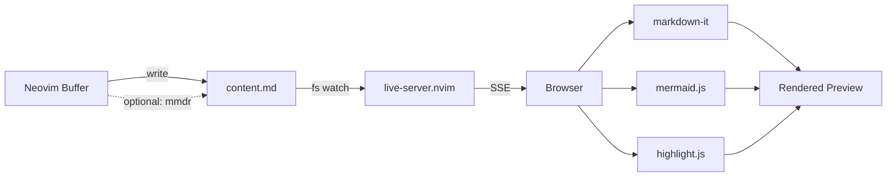

# markup-preview.nvim

Live preview for markup documents in Neovim.

Supports:
- Markdown documents
- Mermaid diagrams
- Org-mode Mermaid blocks

This plugin is a fork of `selimacerbas/markdown-preview.nvim`,
extended with Org-mode support for Mermaid diagrams.

It allows you to write diagrams and structured notes in Org or Markdown
and preview them instantly in the browser using the same fast rendering pipeline.

## What this fork adds

Compared to the original project, this version adds:

- Extraction of **Mermaid diagrams from Org files**
- Previewing diagrams inside `#+begin_src mermaid` blocks
- A workflow that supports **Org as an authoring format**
- The same fast browser preview pipeline used for Markdown

Example Org block:

```org
#+begin_src mermaid
graph TD
A --> B
#+end_src
```

## Features

- Renders entire **Markdown documents** in the browser
- Extracts and renders **Mermaid diagrams from Org files**
- Interactive Mermaid SVG diagrams (zoom, pan, export)
- Instant updates via **Server-Sent Events (no polling)**
- Syntax highlighting via **highlight.js**
- Dark / Light theme toggle
- Optional **Rust-powered Mermaid rendering (~400x faster)**
- No **Node.js** or **npm** required
- Powered by **live-server.nvim** (pure Lua HTTP server)

## Quick start

### Install (lazy.nvim)

```lua
{
  "IvanTurko/markup-preview.nvim",
  dependencies = { "selimacerbas/live-server.nvim" },
  config = function()
    require("markup_preview").setup({
      -- all optional; sane defaults shown
      port = 8421,
      open_browser = true,
      debounce_ms = 300,
    })
  end,
}
```

No prereqs. No `npm install`. Just install and go.

### Use it

Open any Markdown file, then:

- **Start preview:** `:MarkupPreview`
- **Edit freely** — the browser updates instantly as you type
- **Force refresh:** `:MarkupPreviewRefresh`
- **Stop:** `:MarkupPreviewStop`

> The first start opens your browser. Subsequent updates reuse the same tab.

**`.mmd` / `.mermaid` files** are fully supported — the entire file is rendered as a diagram.

For **other non-markdown files**, place your cursor inside a fenced ```` ```mermaid ```` block — the plugin extracts and previews just that diagram.

---

## Commands

| Command                | Description          |
|------------------------|----------------------|
| `:MarkupPreview`       | Start preview        |
| `:MarkupPreviewRefresh`| Force refresh        |
| `:MarkupPreviewStop`   | Stop preview         |

No keymaps are set by default — map them however you like. Suggested:

```lua
vim.keymap.set("n", "<leader>mps", "<cmd>MarkupPreview<cr>", { desc = "Markup: Start preview" })
vim.keymap.set("n", "<leader>mpS", "<cmd>MarkupPreviewStop<cr>", { desc = "Markup: Stop preview" })
vim.keymap.set("n", "<leader>mpr", "<cmd>MarkupPreviewRefresh<cr>", { desc = "Markup: Refresh preview" })
```

---

## Browser UI

The preview opens a polished browser app with:

- **Full Markdown rendering** — GitHub-flavored styling with colored heading borders, lists, tables, blockquotes, code, images, links, horizontal rules
- **Syntax-highlighted code blocks** — powered by highlight.js, with language badges
- **Interactive Mermaid diagrams** — rendered inline as SVGs:
  - Hover a diagram to reveal the **expand button**
  - Click to open a **fullscreen overlay** with zoom, pan, fit-to-width/height, and SVG export
- **Dark / Light theme** toggle (sun/moon icon in header)
- **Live connection indicator** — green dot when SSE is connected
- **Per-diagram error handling** — if one mermaid block is invalid, only that block shows an error; the rest of the page renders fine
- **Iconify auto-detection** — icon packs like `logos:google-cloud` are loaded on demand

---

## Configuration

```lua
require("markup_preview").setup({
  port = 8421,                          -- server port
  open_browser = true,                  -- auto-open browser on start

  content_name = "content.md",          -- workspace content file
  index_name = "index.html",            -- workspace HTML file
  workspace_dir = nil,                  -- nil = per-buffer (recommended); set a path to override

  overwrite_index_on_start = true,      -- copy plugin's index.html on every start

  auto_refresh = true,                  -- auto-update on buffer changes
  auto_refresh_events = {               -- which events trigger refresh
    "InsertLeave", "TextChanged", "TextChangedI", "BufWritePost"
  },
  debounce_ms = 300,                    -- debounce interval
  notify_on_refresh = false,            -- show notification on refresh

  mermaid_renderer = "js",              -- "js" (browser mermaid.js) or "rust" (mmdr CLI, ~400x faster)
})
```

---

## Example



---

## How it works

```
Neovim buffer
    |
    |  (autocmd: debounced write)
    v
workspace/content.md
    |
    |  (live-server.nvim detects change)
    v
SSE event --> Browser
    |
    |  markdown-it --> HTML
    |  mermaid.js  --> inline SVG diagrams
    |  highlight.js --> syntax highlighting
    |  morphdom    --> efficient DOM diffing
    v
Rendered preview (scroll preserved, no flicker)
```

- **Rust renderer** (`mermaid_renderer = "rust"`): mermaid fences are pre-rendered to SVG via the `mmdr` CLI before writing to `content.md` — the browser receives ready-made SVGs with no mermaid.js overhead. Failed blocks fall back to browser-side rendering automatically.
- **Markdown files**: The entire buffer is written to `content.md`
- **Mermaid files** (`.mmd`, `.mermaid`): The entire buffer is wrapped in a mermaid code fence
- **Other files**: The mermaid block under the cursor is extracted (via Tree-sitter or regex fallback) and wrapped in a code fence
- **SSE** (Server-Sent Events) from `live-server.nvim` push updates instantly — no polling
- **morphdom** diffs the DOM efficiently, preserving scroll position and interactive state
- **Per-buffer workspaces** under `~/.cache/nvim/markup-preview/<hash>/` prevent collisions between Neovim instances

---

## Dependencies

- **Neovim** 0.9+
- **[live-server.nvim](https://github.com/selimacerbas/live-server.nvim)** — pure Lua HTTP server (no npm)
- **Tree-sitter** with the **Markdown** parser (recommended for mermaid block extraction)
- **[mermaid-rs-renderer](https://github.com/mermaid-rs/mermaid-rs-renderer)** (optional) — `cargo install mermaid-rs-renderer` for ~400x faster mermaid rendering. Set `mermaid_renderer = "rust"` in config to enable.

Browser-side libraries are loaded from CDN (cached by your browser):
- [markdown-it](https://github.com/markdown-it/markdown-it) — Markdown parser
- [Mermaid](https://mermaid.js.org/) — diagram engine
- [highlight.js](https://highlightjs.org/) — syntax highlighting
- [morphdom](https://github.com/patrick-steele-idem/morphdom) — DOM diffing

---

## Troubleshooting

**Browser shows nothing or "Loading..."**
- Make sure `live-server.nvim` is installed and loadable: `:lua require("live_server")`
- Check the port isn't in use: change `port` in config

**Mermaid diagram not rendering**
- The diagram syntax must be valid Mermaid — check the error chip on the diagram block
- Invalid diagrams show the last good render + error message

**Port conflict**
- Stop with `<leader>mpS`, change `port` in config, restart with `<leader>mps`

## Thanks

- [Mermaid](https://mermaid.js.org/) for the diagram engine
- [Iconify](https://iconify.design/) for icon packs
- [markdown-it](https://github.com/markdown-it/markdown-it) for Markdown parsing
- [highlight.js](https://highlightjs.org/) for syntax highlighting
- [morphdom](https://github.com/patrick-steele-idem/morphdom) for efficient DOM updates

